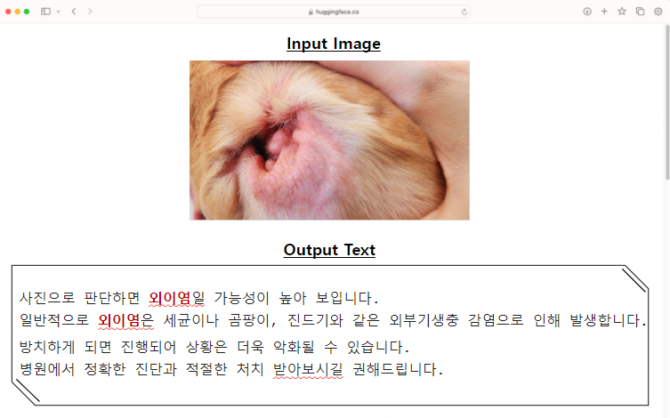

# 🐾 반려동물 피부질환 상담 멀티모달 챗봇 구현 프로젝트

## 모델 사용법
```python
from transformers import pipeline

def generate_caption(image_url, model_name="sihoon00/multimodla-Bitamin", max_new_tokens=150):
    captioner = pipeline("image-to-text", model=model_name)
    result = captioner(image_url, max_new_tokens=max_new_tokens)
    return result[0]["generated_text"]

## 여기에 올바른 이미지 url을 입력하면 캡션이 생성됩니다.
image_url = 'https://img.lifet.co.kr/07f3f846-edf1-4d24-87e2-10d6930b5794'
caption = generate_caption(image_url)
print(caption)
```
```python
Model Output: 해당 사진은 외이염으로 보입니다. 외이염은 ...
```

## 🏅나의 역할
- **Dataset Crawling & Preprocessing**
  - Crawling
      - 지식인 Expert, Lifet 에서 반려동물 피부 사진 및 질문 + 전문가의 답변 데이터셋 수집
  - Preprocessing
      - 강아지, 고양이 사진이 아니거나 광고 글, 전문가의 답변이 아닌 글 제거
      - 불용어, 비속어, 띄어쓰기 등 세부 텍스트 전처리
- **Inference & Prompt 조정**
    - 한국어 Image Captioning Model을 찾고 싶었으나 프로젝트 시점에서는 개발된 모델이 없었음
    - 그래서 팀원 중 시훈이 VIT-GPT2 모델 로직을 구현해 이미지에 대한 캡션을 GPT로 생성하는 Task로 설계하였음
    - GPT로 피부 질환 이미지에 적절한 캡션을 생성하는 프롬프트를 조정하면서 답변의 품질을 올리고자 시도하였음
    
## 🎯 1. 프로젝트 소개
### 🧑‍🤝‍🧑 **팀원**
- **비타민 12기 : 구준회(Leader), 서은서, 이수정, 최시훈**
 
### 📅 **시기**
- **2024년 여름방학**

### 🕹️ **주제**
- **반려동물 피부질환에 대한 상담을 제공하는 멀티모달 챗봇 구현**

### 😄 **역할**
- **구준회 (Leader)** : **데이터 수집과 전처리, 후처리, 모델 평가 및 프롬프트 조정** 
- **서은서** : **라이펫 데이터 크롤링 및 전처리, Vision모델 탐구**
- **이수정** : **라이펫 데이터 크롤링 및 전처리, Vision모델 탐구**
- **최시훈** : **모델 탐구, 모델 학습, 네이버 지식인 데이터 수집, 전처리**

### 🎯 **목표**
- **반려동물 보호자들에게 정확하고 신속한 피부질환 상담 서비스 제공**
- **AI 기술을 통한 상담 정확도 및 효율성 증대**
- **맞춤형 상담을 통해 개인화 서비스 제공**

## 📊 2. 데이터 수집
- **네이버 지식iN 데이터 중 수의사 답변만 크롤링**
- **라이펫 데이터 크롤링**
- 수의학적 지식을 위해 추가 데이터 탐색 및 조사

## 💻 3. 모델 학습
### 3-0. Task 관련
- 초기에 VQA Task로 진행하기 위해 한국어 기반 VQA 모델 탐색
  - But, BLIP VQA, KVQA 등 찾아보았지만 한국어 기반 VQA 모델의 부재로 Image Captioning Model 2차 탐색
  - 겨우겨우 VIT-GPT2 모델을 찾아 사용
    
### 3-1. 모델 관련
- 이미지 및 텍스트 인식을 위한 ViT 기반 모델 활용
- 이미지에 대한 적절한 답변을 생성하기 위해 GPT2와 같은 생성형 모델 활용
- VIT와 GPT2를 결합한 형태의 VIT-GPT2 모델 활용

### 3-2. 학습 방법
- **다양한 피부질환 사례를 포함한 데이터셋 구축**
- **시각적 데이터와 텍스트 데이터의 통합 학습 진행**

## 📈 4. 주요 성과


- **실시간 반응성 및 정확도 향상**
- **사용자 경험 개선을 위한 인터페이스 최적화**
- **다양한 피부질환에 대한 포괄적인 지식베이스 구축**

## 🔍 5. 향후 계획  
- **지속적인 데이터 업데이트 및 모델 개선**
- **사용자 피드백을 바탕으로 서비스 개선**
- **모바일 앱 확장을 통한 접근성 증대**

## 🧹 6. 참조
- **프로젝트 리포지터리** : [GitHub Link](https://ankur3107.github.io/blogs/the-illustrated-image-captioning-using-transformers/)
- **관련 연구 자료** : [학술 자료 링크](#)
